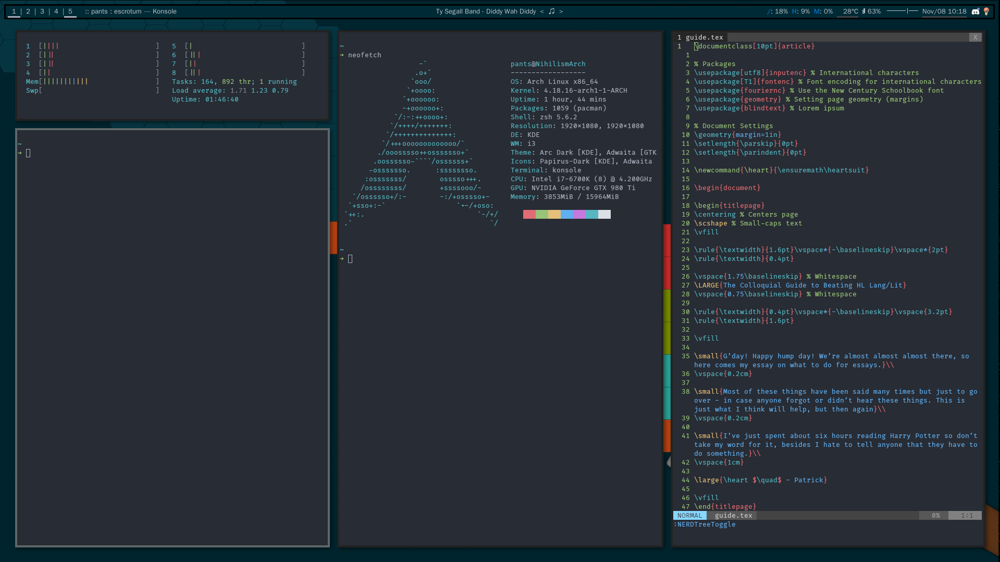

# Dotfiles

## Deployment

The dotfiles may be deployed to their appropriate locations using `stow $DIR_NAME`. This requires the GNU Stow dependency.

## WM/DE

I am running KDE Plasma with i3-gaps for my window manager, making this config extra weird and hacky. I would not recommend you clone this without seriously reading through it. Instead, pick and choose what you want to take.

## Bar

Polybar, run on i3 startup.

Polybar in this instance is floating a few pixels away from the top and side of the screen. This is hard to get done with i3 enabled, so what I have setup is a second, invisible bar that floats ontop of the main bar, in order to create the desired vertical gap. This does, however, create some trouble when trying to click on buttons on the right-side of polybar, such as the system tray.

## Credit

*I'll start accrediting people soon. Too many sources to do that right now.*
